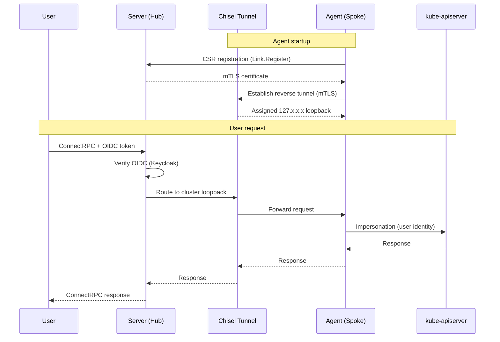

# OtterScale

**Multi-cluster Kubernetes API gateway — a unified ConnectRPC endpoint over Chisel reverse tunnels, secured with OIDC and mTLS.**

OtterScale provides a single, authenticated entry point to many Kubernetes clusters — including clusters behind NAT, firewalls, or in air-gapped environments. A central **server (hub)** accepts ConnectRPC requests, while lightweight **agents (spokes)** running inside each cluster dial home over an mTLS reverse tunnel and forward requests to their local `kube-apiserver` with the caller's identity preserved through impersonation. The result is consistent RBAC, discovery, and runtime operations across every connected cluster.

> The original OtterScale repository now lives at [legacy](https://github.com/otterscale/legacy). This repository houses the core application; the user interface has moved to [dashboard](https://github.com/otterscale/dashboard).

## Architecture

## Features

- **Link** — Agent registration with auto-provisioned mTLS certificates via a CSR flow.
- **Resources** — Generic Kubernetes CRUD, watch, and server-side apply across clusters.
- **Runtime** — Exec/TTY, log streaming, port-forward, scaling, and rolling restarts.
- **Discovery** — API resource discovery and OpenAPI schema resolution with a TTL cache.
- **Security** — FIPS 140-3, OIDC (Keycloak), per-tunnel mTLS, and user impersonation for RBAC.

## Documentation

Installation, configuration, and operational guides will be published in the project documentation. In the meantime, `otterscale server --help` and `otterscale agent --help` describe the available options.

## Ecosystem

OtterScale's open-source components live across these repositories:

| Repository                                                       | Description                                      |
| ---------------------------------------------------------------- | ------------------------------------------------ |
| [otterscale](https://github.com/otterscale/otterscale)           | Multi-cluster Kubernetes API gateway (this repo) |
| [dashboard](https://github.com/otterscale/dashboard)             | Web management UI                                |
| [api](https://github.com/otterscale/api)                         | Shared API contract — CRDs + ConnectRPC services |
| [types](https://github.com/otterscale/types)                     | Generated TypeScript type definitions            |
| [tenant-operator](https://github.com/otterscale/tenant-operator) | Workspace / multi-tenancy operator               |

## Contributing

Contributions are welcome. A contribution guide (`CONTRIBUTING.md`) will follow; until then, please open an issue or a pull request to get involved.

## License

This project is licensed under the [Apache License 2.0](LICENSE).

