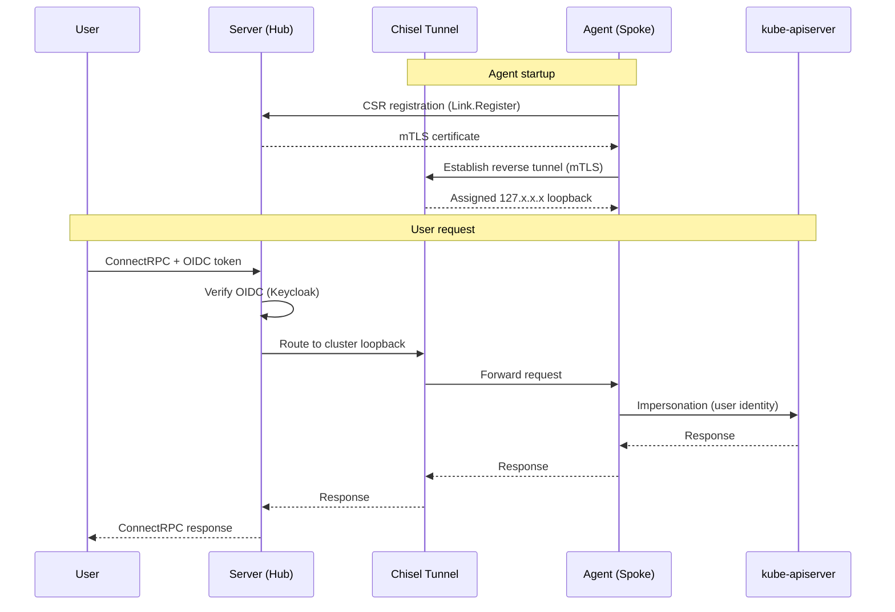

# OtterScale

[](https://github.com/otterscale/otterscale/releases)
[](https://opensource.org/license/apache-2-0)
[](https://github.com/otterscale/otterscale/actions/workflows/ci.yml)
[](https://codecov.io/gh/otterscale/otterscale)
[](https://goreportcard.com/report/github.com/otterscale/otterscale)
[](https://go.dev/doc/security/fips140)

**Multi-cluster Kubernetes API gateway — a unified ConnectRPC endpoint over Chisel reverse tunnels, secured with OIDC and mTLS.**

OtterScale provides a single, authenticated entry point to many Kubernetes clusters — including clusters behind NAT, firewalls, or in air-gapped environments. A central **server (hub)** accepts ConnectRPC requests, while lightweight **agents (spokes)** running inside each cluster dial home over an mTLS reverse tunnel and forward requests to their local `kube-apiserver` with the caller's identity preserved through impersonation. The result is consistent RBAC, discovery, and runtime operations across every connected cluster.

> The original OtterScale repository now lives at [legacy](https://github.com/otterscale/legacy). This repository houses the core application; the user interface has moved to [dashboard](https://github.com/otterscale/dashboard).

## Architecture


```mermaid
  sequenceDiagram
    participant User
    participant Server as Server (Hub)
    participant Tunnel as Chisel Tunnel
    participant Agent as Agent (Spoke)
    participant K8s as kube-apiserver

    Note over Agent, Tunnel: Agent startup
    Agent->>Server: CSR registration (Link.Register)
    Server-->>Agent: mTLS certificate
    Agent->>Tunnel: Establish reverse tunnel (mTLS)
    Tunnel-->>Agent: Assigned 127.x.x.x loopback

    Note over User, K8s: User request
    User->>Server: ConnectRPC + OIDC token
    Server->>Server: Verify OIDC (Keycloak)
    Server->>Tunnel: Route to cluster loopback
    Tunnel->>Agent: Forward request
    Agent->>K8s: Impersonation (user identity)
    K8s-->>Agent: Response
    Agent-->>Tunnel: Response
    Tunnel-->>Server: Response
    Server-->>User: ConnectRPC response
```

## Features

- **Link** — Agent registration with auto-provisioned mTLS certificates via a CSR flow.
- **Resources** — Generic Kubernetes CRUD, watch, and server-side apply across clusters.
- **Runtime** — Exec/TTY, log streaming, port-forward, scaling, and rolling restarts.
- **Discovery** — API resource discovery and OpenAPI schema resolution with a TTL cache.
- **Security** — FIPS 140-3, OIDC (Keycloak), per-tunnel mTLS, and user impersonation for RBAC.

## Enrolling a cluster

Registration is the one endpoint agents reach before they have any credentials, so it is authorised by an **enrolment token** instead. The server holds a single root secret (`--enrolment-secret`, `--enrolment-secret-file`, or `OTTERSCALE_SERVER_ENROLMENT_SECRET`) and refuses to start without one; each cluster's token is derived from that secret and the cluster's name.

Issue a token wherever the root secret is available — most conveniently inside the server itself, so the secret never leaves the pod:

```console
$ kubectl exec deploy/otterscale-server -- /otterscale enrolment-token --cluster prod
xlbQpGep3w9ZJpaDyUzKpHXVTcw_5pO5mNgT3qnf3Ss
```

Then install the agent with it:

```console
$ helm install otterscale-agent otterscale/otterscale-agent \
    --set cluster=prod \
    --set enrolmentToken=xlbQpGep3w9ZJpaDyUzKpHXVTcw_5pO5mNgT3qnf3Ss
```

What this does and does not give you:

- A token authorises **one cluster**. An agent holding `prod`'s token cannot register as `staging`, so a compromised agent cannot take over another cluster's traffic.
- A rejected token changes nothing. The check runs before any state is touched, so a bad registration cannot displace the agent currently serving that cluster.
- Tokens **do not expire** and cannot be revoked one by one. Rotating the root secret invalidates every token at once, after which each agent needs its new token.
- The token is sent in the registration request, so `--server-url` should be `https://`. The agent warns at startup when it is plain HTTP to a remote host — legitimate only when something else (a service mesh, for instance) provides the transport security.
- With `--set`, the token is stored in the Helm release's values and is readable by anyone who can read Secrets in that namespace.

## Operating the server

The server keeps its tunnel state in memory, which shapes how it is deployed:

- **Run a single replica.** Cluster registrations, allocated loopback addresses, and live tunnel sessions live in the process that accepted them. A second replica would have its own registry and its own CA, so agents registered against one replica cannot be reached through the other, and requests routed to the wrong replica fail with "cluster not registered". Horizontal scaling needs shared state and tunnel affinity, which the current design does not provide.
- **Restarts re-key every agent.** The tunnel CA is generated at startup and never persisted, so agent certificates issued before a restart stop being trusted. Agents detect the dropped session and re-register automatically with exponential backoff, but their clusters are unreachable until they do — expect a short interruption after every restart or redeploy.
- **Agent certificates are short-lived** (24 hours) by design. Renewal happens through the same re-registration path, so no manual rotation is required.

## Documentation

Installation, configuration, and operational guides will be published in the project documentation. In the meantime, `otterscale server --help` and `otterscale agent --help` describe the available options.

## Contributing

Contributions are welcome. A contribution guide (`CONTRIBUTING.md`) will follow; until then, please open an issue or a pull request to get involved.

## License

This project is licensed under the [Apache License 2.0](LICENSE).

[](https://app.fossa.com/projects/git%2Bgithub.com%2Fotterscale%2Fotterscale?ref=badge_large&issueType=license)
