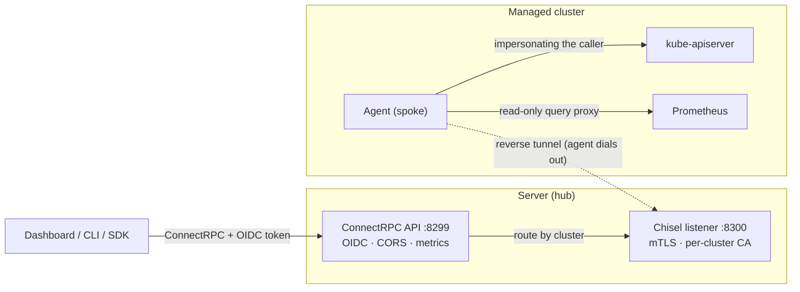
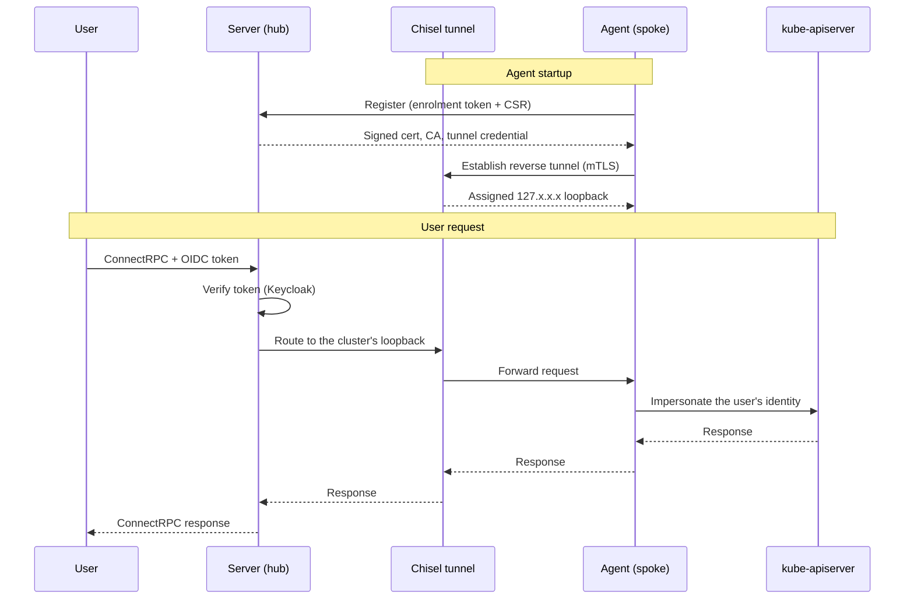

# OtterScale

[](https://github.com/otterscale/otterscale/releases)
[](https://opensource.org/license/apache-2-0)
[](https://github.com/otterscale/otterscale/actions/workflows/ci.yml)
[](https://codecov.io/gh/otterscale/otterscale)
[](https://goreportcard.com/report/github.com/otterscale/otterscale)
[](https://go.dev/doc/security/fips140)

**One authenticated API for many Kubernetes clusters — a unified ConnectRPC endpoint over Chisel reverse tunnels, secured with OIDC and mTLS.**

Reaching a cluster that sits behind NAT, a corporate firewall, or in an air-gapped network usually means a VPN, a jump host, or a kubeconfig per cluster. OtterScale inverts the direction: a central **server (hub)** exposes one ConnectRPC API, and a lightweight **agent (spoke)** inside each cluster dials _out_ to the hub over an mTLS reverse tunnel. Requests arriving at the hub are routed down the right tunnel and replayed against that cluster's `kube-apiserver` **as the calling user**, through Kubernetes impersonation — so the cluster's own RBAC still decides what happens, and no long-lived cluster credential ever leaves the cluster.

> The original OtterScale repository now lives at [legacy](https://github.com/otterscale/legacy). This repository houses the core application; the user interface has moved to [dashboard](https://github.com/otterscale/dashboard).

## Contents

- [Architecture](#architecture)
- [API surface](#api-surface)
- [Getting started](#getting-started)
- [Enrolling a cluster](#enrolling-a-cluster)
- [Configuration](#configuration)
- [Operating the server](#operating-the-server)
- [Generated clients](#generated-clients)
- [Development](#development)

## Architecture

Two roles, one binary. `otterscale server` runs the hub; `otterscale agent` runs in each managed cluster.


```mermaid
flowchart LR
    subgraph hub["Server (hub)"]
        api["ConnectRPC API :8299<br/>OIDC · CORS · metrics"]
        tun["Chisel listener :8300<br/>mTLS · per-cluster CA"]
    end

    subgraph edge["Managed cluster"]
        agent["Agent (spoke)"]
        kas["kube-apiserver"]
        prom["Prometheus"]
    end

    client["Dashboard / CLI / SDK"] -->|"ConnectRPC + OIDC token"| api
    api -->|"route by cluster"| tun
    agent -.->|"reverse tunnel (agent dials out)"| tun
    agent -->|"impersonating the caller"| kas
    agent -->|"read-only query proxy"| prom
```

Registration and a request, end to end:


```mermaid
sequenceDiagram
    participant User
    participant Server as Server (hub)
    participant Tunnel as Chisel tunnel
    participant Agent as Agent (spoke)
    participant K8s as kube-apiserver

    Note over Agent, Tunnel: Agent startup
    Agent->>Server: Register (enrolment token + CSR)
    Server-->>Agent: Signed cert, CA, tunnel credential
    Agent->>Tunnel: Establish reverse tunnel (mTLS)
    Tunnel-->>Agent: Assigned 127.x.x.x loopback

    Note over User, K8s: User request
    User->>Server: ConnectRPC + OIDC token
    Server->>Server: Verify token (Keycloak)
    Server->>Tunnel: Route to the cluster's loopback
    Tunnel->>Agent: Forward request
    Agent->>K8s: Impersonate the user's identity
    K8s-->>Agent: Response
    Agent-->>Tunnel: Response
    Tunnel-->>Server: Response
    Server-->>User: ConnectRPC response
```

The properties that fall out of this design:

- **No inbound firewall rules.** Agents dial the hub, never the other way round.
- **The caller's identity survives the hop.** Every request reaches `kube-apiserver` under the OIDC subject that made it, so authorisation stays with the cluster's RBAC rather than a shared service account.
- **Credentials are short-lived and per-cluster.** The hub signs a 24-hour certificate per agent from a CA it generates at startup; each tunnel gets its own credential.
- **FIPS 140-3.** The binary is built with `GOFIPS140=certified` and ships with `GODEBUG=fips140=on`.

## API surface

Three ConnectRPC services, defined in [proto/](proto/) and served over gRPC, gRPC-Web, and Connect (JSON over HTTP) on the same port.

| Service                       | RPCs                                                                                                                                                    | Purpose                                                                                                                                                                        |
| ----------------------------- | ------------------------------------------------------------------------------------------------------------------------------------------------------- | ------------------------------------------------------------------------------------------------------------------------------------------------------------------------------ |
| `link.v1.LinkService`         | `Register`, `ListLinks`                                                                                                                                 | Agent enrolment via CSR, and the roster of connected clusters.                                                                                                                 |
| `resource.v1.ResourceService` | `Discovery`, `Schema`, `List`, `Get`, `Describe`, `Create`, `Apply`, `Update`, `Delete`, `Watch`                                                        | Generic typed and unstructured access to any Kubernetes resource, including server-side apply and streaming watches. Discovery and OpenAPI schemas are TTL-cached per cluster. |
| `runtime.v1.RuntimeService`   | `PodLog`, `ExecuteTTY`/`WriteTTY`/`ResizeTTY`, `PortForward`/`WritePortForward`, `VNC`/`WriteVNC`, `Scale`, `Restart`, `SubResourceAction`, `ShowChart` | Interactive operations: log follow, exec with a resizable TTY, port-forward, VNC consoles, scaling, rolling restarts, and Helm chart inspection.                               |

Alongside them the server mounts:

- `/proxy/{cluster}/prometheus/{path...}` — a read-only proxy to each cluster's in-cluster Prometheus. Only query endpoints pass the allowlist; admin paths (`/api/v1/admin/*`, `/-/*`) are rejected after path normalisation. Authorisation here is deliberately cluster-agnostic — any authenticated user may query any registered cluster's metrics — unlike the Kubernetes paths, which enforce per-cluster RBAC by impersonation.
- `/metrics` — OpenTelemetry-derived Prometheus metrics. **Authenticated like every other route**, because it exposes cluster names and per-procedure call patterns; a scrape needs a bearer token (Prometheus can obtain one with an `oauth2:` section pointed at the same Keycloak client).
- gRPC health checking and server reflection, both public.

Only `link.v1.LinkService/Register`, health, and reflection are reachable without an OIDC token.

## Getting started

### Build

Go 1.26 or later:

```console
$ make build
$ ./bin/otterscale --help
```

Or use the published container image:

```console
$ docker run --rm ghcr.io/otterscale/otterscale:latest --help
```

### Run the server

The server needs a Keycloak realm to validate tokens against and an enrolment secret to issue agent tokens from. It refuses to start without either.

```console
$ otterscale server \
    --address=:8299 \
    --tunnel-address=0.0.0.0:8300 \
    --external-tunnel-url=https://tunnel.example.com:8300 \
    --keycloak-realm-url=https://sso.example.com/realms/otterscale \
    --enrolment-secret-file=/etc/otterscale/enrolment-secret
```

`--external-tunnel-url` matters: agents pin the CA and verify the hostname, so the certificate is issued for the name they actually dial. When the flag is omitted, the host from `--tunnel-address` is used, which only works when that address is a concrete name rather than a wildcard.

### Run an agent

Inside a managed cluster, with an [enrolment token](#enrolling-a-cluster):

```console
$ otterscale agent \
    --cluster=prod \
    --server-url=https://api.example.com \
    --tunnel-server-url=https://tunnel.example.com:8300 \
    --enrolment-token-file=/etc/otterscale/enrolment-token
```

The agent uses the in-cluster service account when it runs as a Pod, and falls back to the ambient kubeconfig outside the cluster — handy for a local trial run against a kind or minikube cluster.

## Enrolling a cluster

Registration is the one endpoint agents reach before they have any credentials, so it is authorised by an **enrolment token** instead. The server holds a single root secret (`--enrolment-secret`, `--enrolment-secret-file`, or `OTTERSCALE_SERVER_ENROLMENT_SECRET`) and refuses to start without one; each cluster's token is derived from that secret and the cluster's name.

Issue a token wherever the root secret is available — most conveniently inside the server itself, so the secret never leaves the pod:

```console
$ kubectl exec deploy/otterscale-server -- /otterscale enrolment-token --cluster prod
xlbQpGep3w9ZJpaDyUzKpHXVTcw_5pO5mNgT3qnf3Ss
```

Then install the agent with it:

```console
$ helm install otterscale-agent otterscale/otterscale-agent \
    --set cluster=prod \
    --set enrolmentToken=xlbQpGep3w9ZJpaDyUzKpHXVTcw_5pO5mNgT3qnf3Ss
```

What this does and does not give you:

- A token authorises **one cluster**. An agent holding `prod`'s token cannot register as `staging`, so a compromised agent cannot take over another cluster's traffic.
- A rejected token changes nothing. The check runs before any state is touched, so a bad registration cannot displace the agent currently serving that cluster.
- Tokens **do not expire** and cannot be revoked one by one. Rotating the root secret invalidates every token at once, after which each agent needs its new token.
- The token is sent in the registration request, so `--server-url` should be `https://`. The agent warns at startup when it is plain HTTP to a remote host — legitimate only when something else (a service mesh, for instance) provides the transport security.
- With `--set`, the token is stored in the Helm release's values and is readable by anyone who can read Secrets in that namespace.

## Configuration

Every option can be given three ways. Highest precedence wins:

1. CLI flags — `--keycloak-realm-url=…`
2. Environment variables — `OTTERSCALE_SERVER_KEYCLOAK_REALM_URL=…`
3. `config.yaml` in the working directory or `/etc/otterscale/`
4. Compiled defaults

### Server

| Flag                      | Environment variable                      | Default                             |
| ------------------------- | ----------------------------------------- | ----------------------------------- |
| `--address`               | `OTTERSCALE_SERVER_ADDRESS`               | `:8299`                             |
| `--allowed-origins`       | `OTTERSCALE_SERVER_ALLOWED_ORIGINS`       | _(none)_                            |
| `--tunnel-address`        | `OTTERSCALE_SERVER_TUNNEL_ADDRESS`        | `127.0.0.1:8300`                    |
| `--external-tunnel-url`   | `OTTERSCALE_SERVER_EXTERNAL_TUNNEL_URL`   | _(none)_                            |
| `--keycloak-realm-url`    | `OTTERSCALE_SERVER_KEYCLOAK_REALM_URL`    | _(required)_                        |
| `--keycloak-client-id`    | `OTTERSCALE_SERVER_KEYCLOAK_CLIENT_ID`    | `otterscale-server`                 |
| `--enrolment-secret`      | `OTTERSCALE_SERVER_ENROLMENT_SECRET`      | _(required)_                        |
| `--enrolment-secret-file` | `OTTERSCALE_SERVER_ENROLMENT_SECRET_FILE` | _(takes precedence over the above)_ |

### Agent

| Flag                     | Environment variable                    | Default                                                            |
| ------------------------ | --------------------------------------- | ------------------------------------------------------------------ |
| `--cluster`              | `OTTERSCALE_AGENT_CLUSTER`              | `default`                                                          |
| `--server-url`           | `OTTERSCALE_AGENT_SERVER_URL`           | `http://127.0.0.1:8299`                                            |
| `--tunnel-server-url`    | `OTTERSCALE_AGENT_TUNNEL_SERVER_URL`    | `https://127.0.0.1:8300`                                           |
| `--proxy-prometheus-url` | `OTTERSCALE_AGENT_PROXY_PROMETHEUS_URL` | `http://otterscale-prometheus-kube-prometheus.monitoring.svc:9090` |
| `--enrolment-token`      | `OTTERSCALE_AGENT_ENROLMENT_TOKEN`      | _(required)_                                                       |
| `--enrolment-token-file` | `OTTERSCALE_AGENT_ENROLMENT_TOKEN_FILE` | _(takes precedence over the above)_                                |

`otterscale server --help` and `otterscale agent --help` are authoritative.

## Operating the server

The server keeps its tunnel state in memory, which shapes how it is deployed:

- **Run a single replica.** Cluster registrations, allocated loopback addresses, and live tunnel sessions live in the process that accepted them. A second replica would have its own registry and its own CA, so agents registered against one replica cannot be reached through the other, and requests routed to the wrong replica fail with "cluster not registered". Horizontal scaling needs shared state and tunnel affinity, which the current design does not provide.
- **Restarts re-key every agent.** The tunnel CA is generated at startup and never persisted, so agent certificates issued before a restart stop being trusted. Agents detect the dropped session and re-register automatically with exponential backoff, but their clusters are unreachable until they do — expect a short interruption after every restart or redeploy.
- **Agent certificates are short-lived** (24 hours) by design. Renewal happens through the same re-registration path, so no manual rotation is required.
- **Two ports must be reachable:** `8299` for the API and `8300` for the tunnel. Agents need both — the first to register, the second to stay connected.

## Generated clients

The proto definitions are the single source of truth; three client surfaces are generated from them by `make proto`:

- **Go** — [api/](api/), importable as `github.com/otterscale/otterscale/api/...`.
- **TypeScript** — [ts/](ts/), published as [`@otterscale/api`](https://www.npmjs.com/package/@otterscale/api).
- **OpenAPI** — [openapi.yaml](openapi.yaml), for anything that speaks plain HTTP+JSON. RPCs marked `NO_SIDE_EFFECTS` also accept `GET`.

## Development

```console
$ make build          # build ./bin/otterscale with FIPS 140-3
$ make test           # go test with coverage
$ make vet            # go vet
$ make lint           # golangci-lint
$ make proto          # regenerate Go, TypeScript, and OpenAPI from proto/
$ make proto-lint     # buf lint + format check
$ make proto-breaking # buf breaking-change check against main
$ make help           # list every target
```

Layout:

| Path                                       | What lives there                                                       |
| ------------------------------------------ | ---------------------------------------------------------------------- |
| [cmd/otterscale/](cmd/otterscale/)         | Entry point and Wire injectors.                                        |
| [internal/cmd/](internal/cmd/)             | Cobra commands and the server/agent runtimes.                          |
| [internal/core/](internal/core/)           | Domain logic: links, resources, runtime, sessions, enrolment, caching. |
| [internal/handler/](internal/handler/)     | ConnectRPC handlers translating proto to core.                         |
| [internal/transport/](internal/transport/) | HTTP server, chisel tunnel, in-memory pipe listener.                   |
| [internal/providers/](internal/providers/) | Kubernetes, Helm, chisel, and cache wiring.                            |
| [internal/pki/](internal/pki/)             | The tunnel CA and certificate issuance.                                |

Dependencies are assembled with [Wire](https://github.com/google/wire); after changing a provider set, regenerate with `go tool wire ./...`.

## Contributing

Contributions are welcome. A contribution guide (`CONTRIBUTING.md`) will follow; until then, please open an issue or a pull request to get involved.

## License

This project is licensed under the [Apache License 2.0](LICENSE).

[](https://app.fossa.com/projects/git%2Bgithub.com%2Fotterscale%2Fotterscale?ref=badge_large&issueType=license)
