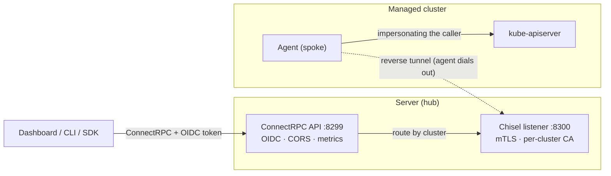

# OtterScale

[](https://github.com/otterscale/otterscale/releases)
[](https://opensource.org/license/apache-2-0)
[](https://github.com/otterscale/otterscale/actions/workflows/ci.yml)
[](https://codecov.io/gh/otterscale/otterscale)
[](https://goreportcard.com/report/github.com/otterscale/otterscale)
[](https://go.dev/doc/security/fips140)

**One authenticated API for many Kubernetes clusters — a unified ConnectRPC endpoint over Chisel reverse tunnels, secured with OIDC and mTLS.**

Reaching a cluster that sits behind NAT, a corporate firewall, or in an air-gapped network usually means a VPN, a jump host, or a kubeconfig per cluster. OtterScale inverts the direction: a central **server (hub)** exposes one ConnectRPC API, and a lightweight **agent (spoke)** inside each cluster dials _out_ to the hub over an mTLS reverse tunnel. Requests arriving at the hub are routed down the right tunnel and replayed against that cluster's `kube-apiserver` **as the calling user**, through Kubernetes impersonation — so the cluster's own RBAC still decides what happens, and no long-lived cluster credential ever leaves the cluster.


```mermaid
flowchart LR
    subgraph hub["Server (hub)"]
        api["ConnectRPC API :8299<br/>OIDC · CORS · metrics"]
        tun["Chisel listener :8300<br/>mTLS · per-cluster CA"]
    end

    subgraph edge["Managed cluster"]
        agent["Agent (spoke)"]
        kas["kube-apiserver"]
    end

    client["Dashboard / CLI / SDK"] -->|"ConnectRPC + OIDC token"| api
    api -->|"route by cluster"| tun
    agent -.->|"reverse tunnel (agent dials out)"| tun
    agent -->|"impersonating the caller"| kas
```

- **No inbound firewall rules** — agents dial the hub, never the other way round.
- **The caller's identity survives the hop** — authorisation stays with each cluster's own RBAC.
- **Short-lived, per-cluster credentials** — a 24-hour certificate per agent, its own credential per tunnel.
- **FIPS 140-3** — built with `GOFIPS140=certified`, shipped with `GODEBUG=fips140=on`.

> The original OtterScale repository now lives at [legacy](https://github.com/otterscale/legacy). This repository houses the core application; the user interface has moved to [dashboard](https://github.com/otterscale/dashboard).

## Quick start

Build from source (Go 1.26+), or use the published image:

```console
$ make build && ./bin/otterscale --help
$ docker run --rm ghcr.io/otterscale/otterscale:latest --help
```

Run the hub. It needs a Keycloak realm to validate tokens against and an enrolment secret to issue agent tokens from, and refuses to start without either:

```console
$ otterscale server \
    --address=:8299 \
    --tunnel-address=0.0.0.0:8300 \
    --external-tunnel-url=https://tunnel.example.com:8300 \
    --keycloak-realm-url=https://sso.example.com/realms/otterscale \
    --enrolment-secret-file=/etc/otterscale/enrolment-secret
```

Mint a token for a cluster, then start its agent with it:

```console
$ kubectl exec deploy/otterscale-server -- /otterscale enrolment-token --cluster prod
xlbQpGep3w9ZJpaDyUzKpHXVTcw_5pO5mNgT3qnf3Ss

$ otterscale agent \
    --cluster=prod \
    --server-url=https://api.example.com \
    --tunnel-server-url=https://tunnel.example.com:8300 \
    --enrolment-token-file=/etc/otterscale/enrolment-token
```

The agent uses the in-cluster service account when it runs as a Pod, and falls back to the ambient kubeconfig outside one — handy for a trial run against kind or minikube.

## Documentation

| Guide                                  | Contents                                                                   |
| -------------------------------------- | -------------------------------------------------------------------------- |
| [Architecture](docs/architecture.md)   | Hub and spoke, the request lifecycle, streaming, and caching.              |
| [API surface](docs/api.md)             | The three ConnectRPC services, the Prometheus proxy, `/metrics`, and auth. |
| [Configuration](docs/configuration.md) | Every flag, environment variable, and default, and how they are resolved.  |
| [Operations](docs/operations.md)       | Enrolling clusters, running the server, monitoring, and troubleshooting.   |
| [Development](docs/development.md)     | Build and test targets, repository layout, and changing the API.           |

Generated clients: Go in [api/](api/), TypeScript as [`@otterscale/api`](https://www.npmjs.com/package/@otterscale/api), and [openapi.yaml](openapi.yaml) for plain HTTP+JSON.

## Contributing

Contributions are welcome. A contribution guide (`CONTRIBUTING.md`) will follow; until then, please open an issue or a pull request to get involved.

## License

This project is licensed under the [Apache License 2.0](LICENSE).

[](https://app.fossa.com/projects/git%2Bgithub.com%2Fotterscale%2Fotterscale?ref=badge_large&issueType=license)
