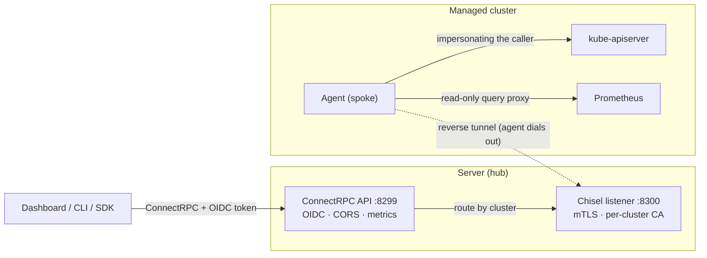
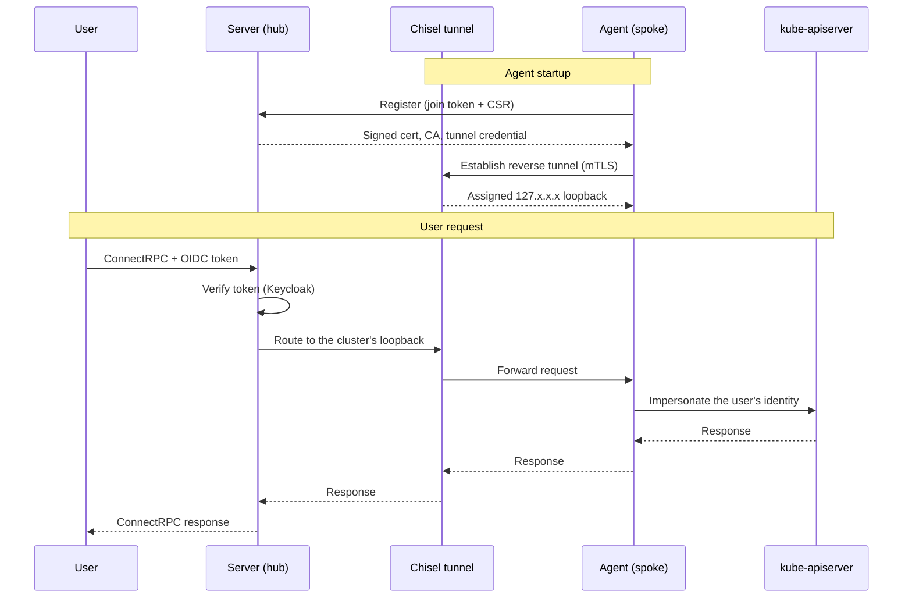

# Architecture

Two roles, one binary. `otterscale server` runs the hub; `otterscale agent` runs in each managed cluster.

## Registration and a request, end to end

## What the design buys

- **No inbound firewall rules.** Agents dial the hub, never the other way round, so a cluster behind NAT or a corporate firewall needs no ingress.
- **The caller's identity survives the hop.** Every request reaches `kube-apiserver` under the OIDC subject that made it, so authorisation stays with the cluster's own RBAC rather than a shared service account.
- **Credentials are short-lived and per-cluster.** The hub signs a 24-hour certificate per agent from a CA it generates at startup; each tunnel gets its own credential.
- **No cluster credential leaves the cluster.** The agent holds the kubeconfig or service account; the hub only ever holds a tunnel to it.
- **FIPS 140-3.** The binary is built with `GOFIPS140=certified` and ships with `GODEBUG=fips140=on`.

## The hub

The server terminates the public API on `:8299` and the chisel tunnel listener on `:8300`.

Requests are authenticated by OIDC (Keycloak) before anything else runs; only agent registration, gRPC health, and reflection are public. Once authenticated, the server resolves the target cluster to the loopback address that cluster's tunnel session is bound to, and forwards.

Tunnel state — registrations, allocated loopbacks, live sessions — is kept in memory, which constrains how the server is deployed. See [operations.md](operations.md#operating-the-server).

The tunnel certificate is issued for the hostname agents actually dial, taken from `--external-tunnel-url` (falling back to the host in `--tunnel-address`). Agents pin the CA and verify that name, so a mismatch fails the handshake at every agent rather than silently degrading.

## The spoke

The agent serves its HTTP handler over an in-memory pipe listener bridged to a local TCP port, which chisel forwards. Nothing is exposed on the cluster network.

Its request timeouts are lifted, because everything it proxies — exec, attach, port-forward, log follow, watch — is unbounded in duration.

For Kubernetes credentials it uses the in-cluster service account when running as a Pod, and falls back to the ambient kubeconfig otherwise, which makes a local trial run against kind or minikube straightforward.

## Long-lived streams

Watch, `PodLog`, `ExecuteTTY`, `PortForward`, and `VNC` are registered on the server as long-running paths, so the transport's request timeouts do not cut a session off mid-flight. Everything else keeps the ordinary timeouts.

## Caching

Discovery answers and API resource lists are cached per cluster with a TTL, because every resource operation validates its GVR first — without the cache, each `List`, `Get`, `Create`, `Watch`, or `Scale` would cost two extra round-trips through the tunnel. A lookup that misses forces a refresh before reporting a resource as unknown, so a newly installed CRD is usable immediately; what the TTL bounds is how long a _removed_ resource keeps being accepted.
